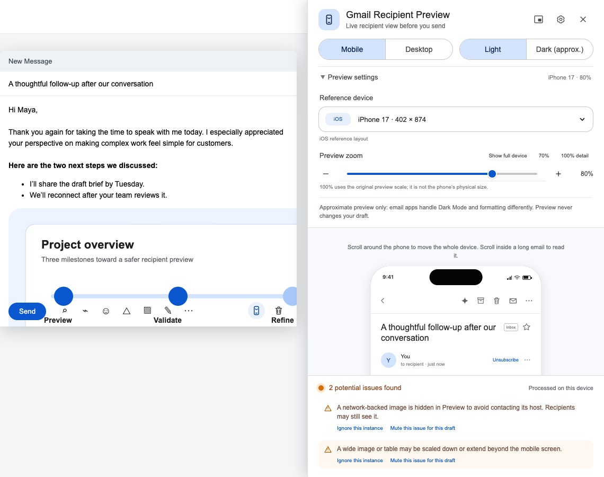

# Gmail Recipient Preview

Gmail Recipient Preview is a local-first Chrome extension that helps non-technical Gmail users inspect how a draft may read on common mobile widths and in an approximate Dark Mode before sending.

> **Status:** Version 0.8.3 is publicly available in the Chrome Web Store. Version 0.8.4 adds localized Store metadata for English and Traditional Chinese. The preview does not promise pixel-identical rendering in Gmail or any other email client.

[Product guide](https://andrehungmy.github.io/gmail-recipient-preview/) · [Privacy Policy](https://andrehungmy.github.io/gmail-recipient-preview/privacy.html) · [Support](https://github.com/andrehungmy/gmail-recipient-preview/issues)



## The user problem

Gmail Compose is a writing surface, not a reliable representation of every recipient's reading environment. Narrow screens, pasted formatting, long strings, wide content, and client-specific Dark Mode transformations can change wrapping, spacing, contrast, and readability after an email is sent.

This extension keeps the original Gmail draft editable and opens a synchronized recipient-oriented reference view beside it. It is a pre-send inspection aid, not an email-client emulator.

## Key features

- Adds one localized Preview control to each detected Gmail Compose window.
- Keeps the active subject, body, rich-text formatting, and safe inline images synchronized while the draft remains editable.
- Offers mobile and desktop reading surfaces plus several labeled reference viewports.
- Provides Light and explicitly approximate Dark Mode views.
- Offers side-panel and draggable floating-preview layouts.
- Flags a small set of actionable risks: hidden or very faint text, low contrast, tiny text, excessive blank space, long URLs, long unbroken strings, wide media/tables, and network-backed images.
- Links each visible warning to its approximate location in Preview, with per-instance ignore, per-draft issue muting, and one-click warning restore controls.
- Sanitizes draft HTML before inserting it into the preview.
- Hides network-backed images in the preview so the extension does not contact their hosts; local `blob:` and allowlisted raster `data:` images can remain visible.
- Supports English and Traditional Chinese.
- Stores only locale, reference-device, and preview-scale preferences in `chrome.storage.local`.
- Uses no account, backend, analytics, telemetry, remote logging, external API, or remote JavaScript.

## What the preview means

The preview is a **useful approximation** of common recipient conditions:

- Reference-device dimensions are logical layout viewports, not physical-size replicas.
- Dark Mode is a conservative visual check, not Gmail iOS, Gmail Android, Apple Mail, or Outlook's native transformation engine.
- Email clients can rewrite markup, colors, fonts, images, quoting, and spacing after send.
- Native-device comparisons are validation references, not a compatibility guarantee.

See [Known limitations](docs/known-limitations.md) for the full product boundary.

## Privacy model

- Draft processing happens inside the active Gmail tab.
- Draft content is held only in the in-page preview while it is open and is not persisted by the extension.
- The content script does not use Gmail-owned `localStorage` as a fallback.
- Network-backed draft images are replaced with a local placeholder in Preview. Gmail itself may already have loaded an image in the Compose surface before the extension reads the draft.
- The extension requests only `storage` and host access to `https://mail.google.com/*`.
- Stored preferences never include subjects, recipients, bodies, images, attachments, or audit results.

Read the public [Privacy Policy](privacy.html), source [PRIVACY.md](PRIVACY.md), and [Privacy and security](docs/privacy-and-security.md) before public distribution.

## Install locally

1. Download or clone this repository.
2. Open `chrome://extensions` in Chrome.
3. Enable **Developer mode**.
4. Select **Load unpacked**.
5. Choose the repository root containing `manifest.json`.
6. Open or refresh Gmail, then open a new message or existing draft.
7. Select Preview beside Gmail's discard-draft control.

Reloading an unpacked extension invalidates content scripts already injected into open Gmail tabs. Refresh Gmail after each extension reload.

## Development setup

Requirements:

- Node.js 22.13 or later
- npm
- Google Chrome or Chromium for browser tests
- `zip` and `unzip` for release packaging

```bash
npm install
npm run validate
npm test
npm run package
npm run package:inspect
```

The extension ships source files directly; there is no production bundler or runtime dependency. `npm run build` is a release validation alias, not a transpilation step.

## Development commands

| Command                   | Purpose                                                                  |
| ------------------------- | ------------------------------------------------------------------------ |
| `npm run format`          | Format maintained documentation, configuration, tools, and tests.        |
| `npm run format:check`    | Check those files without changing them.                                 |
| `npm run lint`            | Run ESLint across browser and Node JavaScript.                           |
| `npm run typecheck`       | Type-check the browser runtime JavaScript with TypeScript `checkJs`.     |
| `npm run test:security`   | Enforce permissions, CSP, network-client, storage, and sanitizer policy. |
| `npm run validate:store`  | Verify Store screenshots, promo tile, and icon dimensions.               |
| `npm test`                | Run deterministic browser tests against the local Gmail-like harness.    |
| `npm run validate`        | Run formatting, lint, typecheck, and static security checks.             |
| `npm run build`           | Run the release validation alias.                                        |
| `npm run package`         | Create an allowlisted extension ZIP under `dist/`.                       |
| `npm run package:inspect` | Verify the ZIP contains exactly the runtime allowlist.                   |
| `npm run release:assets`  | Refresh Landing and Chrome Web Store imagery from the local QA harness.  |
| `npm run release:check`   | Run release validation, browser tests, asset checks, and packaging.      |

## Project structure

```text
.
├── manifest.json              Manifest V3 configuration
├── content.js / content.css   Gmail adapter, preview runtime, sanitizer, audit, and UI
├── popup.*                    Extension toolbar popup
├── landing.*                  Bundled bilingual product guide
├── icons/                     Extension icons
├── assets/landing/            Images used by the bundled guide
├── qa/                        Local Gmail-like harness and fixtures
├── tests/                     Automated browser regression tests
├── tools/                     Security, packaging, inspection, and asset tools
├── docs/                      Architecture, testing, risk, release, and case-study docs
└── .github/                   CI and contributor templates
```

The implemented data flow and lifecycle are documented in [Architecture](docs/architecture.md).

## Testing

Automated browser tests use a local Gmail-like fixture rather than a live mailbox. They cover synchronization, HTML sanitization, blocked remote-image requests, warning highlighting and session controls, screenshot aspect ratios, controls, localization, multiple Compose windows, active-draft cleanup, stale button rebinding, and duplicate initialization.

Real Gmail remains a required manual release gate because Gmail uses private, changing DOM structures. For a non-technical walkthrough, use the [Traditional Chinese manual QA checklist](docs/manual-qa-zh-TW.md). Maintainers can also follow [Testing](docs/testing.md), [TEST_CASES.md](TEST_CASES.md), and [Device research and validation](DEVICE_RESEARCH_AND_VALIDATION.md).

## Packaging

`npm run package` builds `dist/gmail-recipient-preview-v<version>.zip` from an explicit runtime allowlist. Tests, internal notes, store working assets, source maps, environment files, and development configuration are excluded. `npm run package:inspect` fails if any required file is missing or any unexpected file is present.

Packaging does not publish a release or submit to the Chrome Web Store.

Chrome Web Store metadata, privacy answers, reviewer steps, and asset paths are maintained in [Chrome Web Store submission copy](docs/chrome-web-store-listing.md). Version-specific changes and remaining manual gates are recorded in [0.8.4 release notes](docs/releases/v0.8.4.md).

## Current roadmap

1. Run the full real-Gmail lifecycle matrix on Chrome Stable in English and Traditional Chinese.
2. Capture repeatable native Gmail comparison evidence for representative iOS and Android devices.
3. Add a true unpacked-extension smoke test that validates `chrome.storage.local` in an extension origin.
4. Decide and add an explicit software license before accepting outside reuse or contributions.

See the prioritized [Backlog](docs/backlog.md).

## Portfolio case study

The repository demonstrates the current user journey, product constraints, privacy model, technical decisions, trade-offs, verified behavior, and unresolved risks without claiming user metrics or business outcomes. Read [Product case study](docs/product-case-study.md).

## Contributing

Read [CONTRIBUTING.md](CONTRIBUTING.md). Keep changes local-first, permission-minimal, and testable without a live Gmail account whenever possible.

## Security reporting

Do not include real email content, mailbox screenshots, addresses, or other personal data in public issues. Follow [SECURITY.md](SECURITY.md) for private reporting guidance.

## License status

This repository does **not** currently contain an explicit software license. That means public source visibility should not be interpreted as permission to copy, modify, or redistribute the code. Selecting a license is a maintainer decision and a release-readiness item.

## Disclaimer

Gmail is a trademark of Google LLC. This project is independent and is not affiliated with, endorsed by, or guaranteed by Google. Recipient rendering can vary by email client, version, device, settings, accessibility preferences, and server-side transformations.
