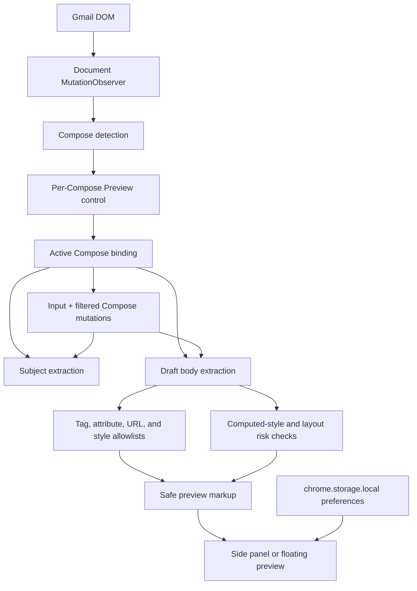

# Architecture

## Scope

Gmail Recipient Preview is a source-shipped Manifest V3 extension. It has no backend, service worker, build-time application framework, remote runtime dependency, or message-passing layer. A static content script owns the Gmail integration and preview lifecycle.

## Runtime components

| Component         | Responsibility                                                                                                                                                          |
| ----------------- | ----------------------------------------------------------------------------------------------------------------------------------------------------------------------- |
| `manifest.json`   | Declares Gmail-only injection, `storage`, popup files, icons, and a self-only extension-page CSP.                                                                       |
| `content.js`      | Detects Compose surfaces, binds controls, extracts drafts, sanitizes HTML, computes warnings, renders the preview, synchronizes updates, manages layout, and cleans up. |
| `content.css`     | Styles the Compose control, panel/floating layouts, device references, approximate themes, warnings, focus states, and reduced motion.                                  |
| `popup.*`         | Explains readiness/privacy and opens the bundled product guide.                                                                                                         |
| `landing.*`       | Provides a bilingual local product guide and installation instructions.                                                                                                 |
| `qa/harness.html` | Supplies a deterministic Gmail-like Compose DOM for browser tests.                                                                                                      |

## Data flow

## Gmail adapter and lifecycle

The scanner considers `div[contenteditable="true"]` candidates inside a dialog that also resembles Compose through a subject field, send control, or discard control. Selectors include English, Traditional Chinese, and Simplified Chinese subject/discard labels where practical. They remain heuristics because Gmail does not expose a stable public Compose DOM API.

Each Compose root gets one bound control. Resize and mutation observers keep it aligned near the discard control. If Gmail removes or clones the control, the runtime disconnects stale observers and creates a new bound instance. Cloned DOM properties are not trusted as proof that event listeners survived.

Only one preview panel is active at a time, but every Compose window keeps its own launch control. Opening a second draft closes the first preview binding and attaches to the selected Compose. If Gmail replaces the active editor or subject field, the binding is refreshed. If the active Compose disappears, the panel closes and all active observers/listeners are disconnected.

## Sanitization boundary

Draft HTML is treated as untrusted. The sanitizer:

1. Parses the body through an inert `template`.
2. Drops active/document-level elements and their content.
3. Unwraps unsupported containers so readable text can remain.
4. Keeps only common email-formatting elements.
5. Keeps only explicit global and per-element attributes.
6. Filters inline CSS to presentation properties and rejects URL-bearing or executable values.
7. Restricts links to `http`, `https`, `mailto`, `tel`, fragments, and root-relative URLs; safe links receive `noopener noreferrer`.
8. Allows only local `blob:` and allowlisted raster base64 `data:` image sources.
9. Replaces every other image source with a non-network placeholder.

The final sanitized string is inserted into the preview body. Subject text is escaped through `textContent` before it enters panel markup. Warning markup is generated only from fixed localization keys.

## State

Runtime state is intentionally small and in-memory:

- active editor, Compose root, and subject field;
- active observers/listeners and pending animation/debounce handles;
- selected mobile/desktop view, Light/approximate Dark Mode, reference viewport, scale, and floating layout;
- current locale.

Only locale, device preset, and preview scale are persisted in `chrome.storage.local`. Draft data and audit results are never written to extension or page storage.

## Layout behavior

The default side panel tries to preserve a usable Compose area. It saves the exact inline `left`, `right`, `width`, and `transition` values it changes and restores them on close or before Gmail window-state actions. Large/full-height Compose surfaces default to Floating preview so the extension does not compete with Gmail-owned geometry.

## Error and cleanup behavior

- Invalid or unavailable extension storage falls back to in-memory defaults; it does not write into Gmail storage.
- Duplicate script initialization exits through an isolated-world instance flag.
- Closing Preview clears timers, animation frames, draft observers, layout observers, keyboard/resize listeners, subject/editor listeners, and temporary Compose geometry.
- Removed Compose buttons disconnect their per-button observers.
- Missing or replaced active draft nodes either rebind or close the orphaned panel.
- User-facing surfaces do not expose stack traces or draft content in logs.

## Intentional non-architecture

The project does not add a background worker, framework, store, backend, message bus, or sanitizer dependency. The current single-file runtime is large, but a broad modular rewrite would add release risk. Future extraction should start with pure sanitization/audit boundaries only when tests can preserve current behavior.
