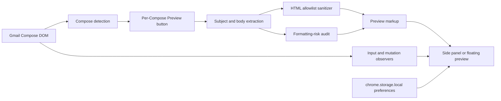

# Repository Audit

**Audit date:** July 26, 2026

**Repository:** Gmail Recipient Preview

**Reviewed version:** `0.8.2`
**Status:** Initial audit; final results will be added after implementation and validation.

## Executive summary

Gmail Recipient Preview is a small, understandable Manifest V3 extension with a deliberately narrow permission boundary and no backend. Its core product flow already works in a local Gmail-like harness: a content script detects Compose editors, adds one preview control per Compose window, sanitizes the selected draft, renders a recipient-oriented preview, and updates it while the draft changes.

The repository is not yet release-ready. The most important verified issue is that sanitized `http`/`https` images are inserted into the preview, which can cause an external image host to receive another request and conflicts with the product's local-processing promise. Release engineering is also incomplete: there is no package manifest or reproducible validation/package command, the checked release archive is stale relative to the working tree, and that archive contains an internal raw screenshot while omitting the three images required by the current Landing page. Automated behavior tests and CI are absent. Several Gmail lifecycle paths can leave observers or an orphaned preview behind.

This working tree contained user-authored changes before this audit began. Those changes are being preserved and treated as part of the current product baseline.

## Current architecture

### Runtime surfaces

- `manifest.json` declares a Manifest V3 content script limited to `https://mail.google.com/*` and the `storage` permission.
- `content.js` owns Gmail DOM detection, button placement, draft extraction, sanitization, risk analysis, state, preview rendering, preference access, layout changes, and cleanup.
- `content.css` styles the Compose control, side panel, floating panel, reference devices, approximate Dark Mode, audit results, focus states, and reduced motion.
- `popup.*` provides a localized extension popup and opens the local product guide.
- `landing.*` provides a localized product and installation page bundled with the extension.
- `qa/harness.html` supplies a local Gmail-like Compose fixture.
- `tools/security-check.mjs` supplies a narrow static security policy check; it is currently untracked user work and has no repository-level command wrapper.

### Primary data flow and trust boundaries

1. A document-level `MutationObserver` scans newly added or hydrated `contenteditable` elements.
2. Gmail-like Compose dialogs receive a preview button positioned relative to the discard control.
3. Selecting Preview binds one global active-preview state to that Compose editor.
4. The subject is read from `input[name="subjectbox"]`; body HTML is read from the editor.
5. Draft HTML is parsed in a `template`, reduced to an element/attribute/style allowlist, and inserted into the extension panel.
6. A separate audit reads computed styles and content from the original Compose DOM.
7. Preview state is updated through input listeners plus a debounced draft `MutationObserver`.
8. Locale, reference-device preset, and preview scale use `chrome.storage.local`; the current content script falls back to page-owned `localStorage` after extension-context invalidation.

Draft HTML is untrusted input. The sanitizer and every preview HTML sink are therefore security boundaries. Image URLs are also a network/privacy boundary even though the extension has no explicit `fetch` client.

## Major strengths

- Manifest V3 with no background worker, remote code, analytics, account system, or backend.
- Host access is limited to Gmail and the only named permission is `storage`.
- Existing sanitizer uses tag, attribute, URL, and inline-style allowlists.
- Subject text is escaped before markup generation.
- Compose geometry is saved and restored rather than permanently overwriting Gmail layout.
- Preview copy already distinguishes reference viewports from physical device size in several surfaces.
- English and Traditional Chinese are supported in the preview, popup, and Landing page.
- Visible focus styles and reduced-motion handling already exist for primary controls.
- A local Gmail-like harness makes deterministic browser validation possible without automating a real mailbox.

## Verified findings and priorities

| Priority | Finding                                                                                    | Evidence                                                                                                                                                                    | Planned response                                                                                                                                               |
| -------- | ------------------------------------------------------------------------------------------ | --------------------------------------------------------------------------------------------------------------------------------------------------------------------------- | -------------------------------------------------------------------------------------------------------------------------------------------------------------- |
| P0       | Remote draft images can initiate external requests from the preview.                       | `safeUrl(..., 'image')` accepts `http:` and `https:` and sanitized images are inserted through `innerHTML`.                                                                 | Block network-backed image sources by default, preserve local inline sources where safe, render a useful placeholder, add a clear risk, and test the behavior. |
| P1       | Content-script preferences can cross into Gmail-owned storage.                             | `content.js` falls back to `window.localStorage` on `mail.google.com` when extension storage is unavailable.                                                                | Fail closed to in-memory defaults/writes instead of persisting into page storage; align privacy documentation.                                                 |
| P1       | Compose button observers are not disconnected when Gmail removes a button or Compose tree. | Resize and mutation observers are stored on the button but no removal path calls `disconnect()`.                                                                            | Add explicit per-button cleanup and cover removal/reinitialization.                                                                                            |
| P1       | Removing the active Compose can leave an orphaned preview.                                 | The global observer rescans removed nodes but does not close when `activeEditor` disconnects.                                                                               | Close and clean up when the active Compose/editor disappears.                                                                                                  |
| P1       | Subject detection and live binding use inconsistent selectors.                             | Compose detection accepts localized `aria-label` selectors, but extraction and event binding use only `input[name="subjectbox"]`.                                           | Centralize subject lookup and rebind when Gmail replaces the subject node.                                                                                     |
| P1       | Current release archive is incomplete and contains an unwanted asset.                      | `release/gmail-recipient-preview-v0.8.2.zip` omits `assets/landing/*.jpg`, which current `landing.html` requires, and includes `assets/store/raw/01-live-mobile-light.png`. | Add deterministic packaging with an explicit allowlist and automated archive inspection.                                                                       |
| P1       | Core browser behavior has no automated regression test.                                    | Only a manual harness and Markdown cases exist.                                                                                                                             | Add local harness fixtures and automated tests for sanitization, sync, multiple Compose windows, controls, cleanup, and no network requests.                   |
| P2       | No standard developer workflow exists.                                                     | No `package.json`, lint config, test command, build command, or CI workflow exists.                                                                                         | Add minimal dependency-light scripts and CI without introducing a production framework.                                                                        |
| P2       | Dark Mode and preview fidelity limits are not explained next to the controls.              | The panel only labels Light/Dark; limitations live mainly in README/Landing copy.                                                                                           | Add localized in-context approximation and draft-integrity copy.                                                                                               |
| P2       | Audit updates are not announced to assistive technology.                                   | Audit text changes without a live-region role.                                                                                                                              | Add a polite status region and validate accessible names/states.                                                                                               |
| P2       | The repository lacks release/open-source documentation.                                    | No architecture, testing, limitations, backlog, release checklist, decision log, contribution guide, security policy, templates, or explicit license file.                  | Add concise documents reflecting the implemented system; flag license as a product decision.                                                                   |
| P3       | `content.js` combines many responsibilities.                                               | Detection, sanitizer, audit, rendering, state, and lifecycle live in one 1,160-line IIFE.                                                                                   | Avoid a broad rewrite; extract only testable or high-risk boundaries when it measurably improves safety.                                                       |

## Initial automated-check baseline

| Check                            | Command                         | Initial status | Final status | Notes                                                                                                                                                                             |
| -------------------------------- | ------------------------------- | -------------: | -----------: | --------------------------------------------------------------------------------------------------------------------------------------------------------------------------------- |
| Manifest parse / security policy | `node tools/security-check.mjs` |           Pass |      Pending | Verifies MV3, narrow permissions, no explicit network client, extension-page script policy, sanitizer markers, and stored-key count. It does not detect `` network behavior. |
| JavaScript syntax                | `node --check content.js`       |           Pass |      Pending | No transpilation/build system is present.                                                                                                                                         |
| JavaScript syntax                | `node --check popup.js`         |           Pass |      Pending |                                                                                                                                                                                   |
| JavaScript syntax                | `node --check landing.js`       |           Pass |      Pending |                                                                                                                                                                                   |
| Formatting whitespace            | `git diff --check`              |           Pass |      Pending | No formatter or formatting command exists.                                                                                                                                        |
| Lint                             | None                            |        Missing |      Pending | No ESLint or equivalent configuration.                                                                                                                                            |
| Typecheck                        | None                            |        Missing |      Pending | Plain JavaScript; no TypeScript or JSDoc typecheck configuration.                                                                                                                 |
| Unit tests                       | None                            |        Missing |      Pending | No test runner or unit suite.                                                                                                                                                     |
| Integration tests                | None                            |        Missing |      Pending | Manual `qa/harness.html` only.                                                                                                                                                    |
| End-to-end tests                 | None                            |        Missing |      Pending | Live Gmail automation is intentionally not used; local browser automation will target the harness.                                                                                |
| Production build                 | None                            |        Missing |      Pending | Source files are shipped directly. A validation command is still needed.                                                                                                          |
| Extension packaging              | Manual/stale archive            |           Fail |      Pending | Existing archive does not match the current working tree and omits required Landing assets.                                                                                       |

## Implementation plan for this pass

1. Close the remote-image and page-storage privacy gaps.
2. Harden subject synchronization, Compose removal, duplicate initialization, and observer cleanup.
3. Improve in-context limitation copy, accessible status updates, and actionable warnings.
4. Add a dependency-light validation, test, and explicit-allowlist packaging workflow.
5. Add minimal CI and public-maintainer templates.
6. Complete architecture, privacy/security, testing, limitations, backlog, decision, release, and portfolio documentation.
7. Run browser tests against the local harness, inspect the archive contents, review the final diff, scan for secrets/logging/network clients, and update this audit with verified final results.

## Current release-readiness assessment

**Not ready for public release.** The repository has a strong MVP foundation, but remote-image behavior, lifecycle cleanup, missing automated regression checks, and the broken/stale release archive are release blockers. Chrome Web Store submission should remain blocked until those issues are fixed and a real Gmail manual QA matrix is run on Chrome Stable.
