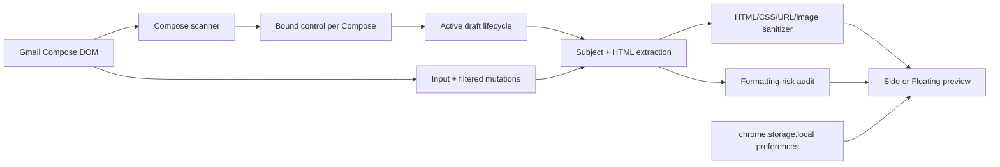

# Repository Audit

**Audit date:** July 28, 2026

**Repository:** Gmail Recipient Preview

**Reviewed version:** `0.8.3`
**Status:** Productization pass implemented and locally validated.

## Executive summary

Gmail Recipient Preview is a small Manifest V3 extension with a narrow Gmail-only permission boundary, no backend, no production dependencies, and a clear core journey: detect Gmail Compose, add one launch control per draft, sanitize the selected draft, show an approximate recipient reading view, and synchronize it while Gmail remains editable.

The pass closed the highest-risk verified gaps. Preview no longer inserts network-backed images, so it does not contact an image host while rendering a draft. The content script no longer falls back to Gmail-owned `localStorage`. Compose observer/listener cleanup, active-draft removal, subject replacement, duplicate initialization, and cloned/stale button rebinding were hardened. The panel now labels Dark Mode and overall fidelity as approximate, announces audit state changes, restores editor focus, and provides clearer warnings.

Release engineering is now reproducible: npm scripts cover formatting, lint, JavaScript type checking, static security policy, browser tests, build validation, explicit-allowlist packaging, and package inspection. Automated browser scenarios pass. The final ZIP contains exactly 18 runtime files, includes the public Privacy Policy and all three Landing images, excludes development/QA/store-working files, and is 260.2 KiB.

The code is materially closer to release-ready, but **Chrome Web Store submission remains blocked** on real Gmail manual QA, native-client comparison evidence, extension-origin smoke testing, licensing, and Store policy/asset review.

This working tree contained modified and untracked user-authored work before the audit began. It was preserved and treated as part of the baseline; no commit, push, release, deployment, or Store submission was performed.

## Architecture summary

- `manifest.json`: MV3, `storage`, Gmail host/content-script declarations, popup, icons, and explicit self-only extension-page CSP.
- `content.js`: Gmail adapter, active-draft lifecycle, extraction, sanitizer, risk analysis, preview state/rendering, storage access, layout, and cleanup.
- `content.css`: launch control, panel/floating layouts, reference surfaces, approximate themes, warnings, focus, placeholders, and reduced motion.
- `popup.*` and `landing.*`: bilingual local product/help surfaces.
- `qa/harness.html` and `tests/browser-tests.mjs`: deterministic synthetic integration environment.
- `tools/*.mjs`: security policy, explicit package allowlist, creation, and archive inspection.

Detailed behavior and boundaries are in `docs/architecture.md` and `docs/privacy-and-security.md`.

## Major strengths

- Manifest V3 with no background worker, remote code, analytics, telemetry, account system, or backend.
- Only `storage` plus `https://mail.google.com/*`; no broad browser permissions.
- Sanitizer uses explicit tag, attribute, URL, CSS, and local-image allowlists.
- Network-backed images become local placeholders before preview insertion.
- Subject text is escaped and risk/localization markup comes from fixed application strings.
- Per-Compose controls and one active preview keep multiple drafts understandable.
- Gmail geometry is saved/restored rather than permanently overwritten.
- English and Traditional Chinese are supported in preview, popup, and guide.
- Core controls have visible focus, reduced-motion handling, editor focus restoration, and a live audit status.
- Source ships directly with zero production dependencies and an auditable 18-file package.

## Verified findings and disposition

| Priority | Finding                                                                                      | Disposition and validation                                                                                                                                                                                 |
| -------- | -------------------------------------------------------------------------------------------- | ---------------------------------------------------------------------------------------------------------------------------------------------------------------------------------------------------------- |
| P0       | Preview could contact remote image hosts by reinserting `http`/`https` images.               | **Fixed.** Only `blob:` and allowlisted raster base64 `data:` images render; others become placeholders. Browser route blocks/records non-local requests and observed none from Preview.                   |
| P1       | Content script wrote preference fallbacks into Gmail page storage.                           | **Fixed.** Failed extension storage uses in-memory defaults/no-op writes. Static and browser tests confirm no `gmailReaderPreview*` key in page storage.                                                   |
| P1       | Removed Compose buttons could retain Resize/Mutation observers.                              | **Fixed.** Per-button cleanup disconnects observers and restores extension-owned positioning when safe.                                                                                                    |
| P1       | Removed active Compose could leave an orphaned panel.                                        | **Fixed.** Active targets rebind when replaced or close/clean up when the Compose disappears.                                                                                                              |
| P1       | Subject selectors and event bindings were inconsistent.                                      | **Fixed.** A shared localized selector drives detection, extraction, and rebinding.                                                                                                                        |
| P1       | Cloned Compose markup could contain a visible but inert cloned extension button.             | **Fixed after browser test reproduced it.** Only a runtime-bound marker counts as initialized; stale markup is replaced.                                                                                   |
| P1       | Existing release ZIP was stale, omitted Landing assets, and included a raw Store screenshot. | **Fixed for newly generated candidates.** Package allowlist includes all required Landing images and excludes Store/QA/dev files. Existing historical ZIP was preserved.                                   |
| P1       | No automated browser behavior coverage.                                                      | **Fixed for local deterministic coverage.** Six scenarios cover sync, controls, sanitization/network, multiple drafts/cleanup, duplicate initialization, and localization.                                 |
| P2       | No standard developer workflow, typecheck, formatter policy, or CI.                          | **Fixed.** Added npm scripts, ESLint, TypeScript `checkJs`, Prettier scope, lockfile, and GitHub Actions workflow.                                                                                         |
| P2       | Fidelity/Dark Mode limits were not visible beside controls.                                  | **Fixed.** Dark is labeled approximate and localized limitation/draft-integrity copy appears in the panel.                                                                                                 |
| P2       | Audit changes were not announced.                                                            | **Fixed.** Summary is a polite atomic live status.                                                                                                                                                         |
| P2       | Release/open-source/portfolio documentation was incomplete.                                  | **Fixed except license decision.** Added architecture, privacy/security, testing, limitations, backlog, release checklist, decision log, case study, contribution/security guidance, and GitHub templates. |
| P3       | `content.js` remains large and multi-responsibility.                                         | **Accepted for this pass.** A broad rewrite was judged riskier than incremental tested hardening; extraction remains in backlog.                                                                           |

## Changes implemented

### Privacy and security

- Blocked all network-backed and unsupported image sources in Preview.
- Added localized image placeholders and remote-image warning copy.
- Removed Gmail `localStorage` preference fallback.
- Added explicit self-only extension-page CSP.
- Expanded static policy checks for version alignment, CSP, page storage, and image controls.
- Updated privacy policy and security review to match implemented behavior.

### Lifecycle and correctness

- Centralized localized subject lookup and active subject rebinding.
- Rebinds replaced editors and closes removed active drafts.
- Disconnects per-button observers when Gmail removes/rebuilds Compose nodes.
- Detects cloned/stale buttons that lost JavaScript bindings.
- Guards duplicate script initialization.
- Clears pending refresh/layout work and restores editor focus on close.
- Added a long-unbroken-string warning and more direct wide-content measurement.

### UX and accessibility

- Labeled Dark Mode as approximate.
- Added in-context fidelity and “draft is not changed” explanation.
- Added a polite live audit status.
- Improved settings focus entry/exit and Escape behavior.
- Added a readable privacy-preserving image placeholder.

### Tooling, testing, CI, and packaging

- Added `package.json`/lockfile, Prettier scope, ESLint, TypeScript `checkJs`, and runtime property types.
- Added deterministic browser tests using installed Chrome and `playwright-core` with all non-local requests blocked.
- Added a stable CI workflow for clean install, validation, browser tests, build, package, and archive inspection.
- Added an explicit 18-file runtime allowlist and deterministic ZIP inspection.
- Added contributor templates and release/open-source/portfolio documentation.

## Baseline and final results

| Check                        | Command                                       |                      Initial status | Final status | Notes                                                                                                                                 |
| ---------------------------- | --------------------------------------------- | ----------------------------------: | -----------: | ------------------------------------------------------------------------------------------------------------------------------------- |
| Clean dependency install     | `npm ci`                                      |                             Missing |         Pass | 73 development packages installed from lockfile; zero production dependencies.                                                        |
| Formatting                   | `npm run format` / `npm run format:check`     | Missing (`git diff --check` passed) |         Pass | Formatting intentionally covers maintained tooling/tests/docs, avoiding a noisy rewrite of legacy runtime UI files.                   |
| Lint                         | `npm run lint`                                |                             Missing |         Pass | ESLint checks browser and Node scripts.                                                                                               |
| Typecheck                    | `npm run typecheck`                           |                             Missing |         Pass | TypeScript `checkJs` covers `content.js`, `landing.js`, and `popup.js`.                                                               |
| Static security              | `npm run test:security`                       |        Pass (narrow initial script) |         Pass | Now covers manifest/package alignment, permissions, CSP, network clients, sanitizer markers, page storage, and persistence key scope. |
| Browser integration          | `npm test`                                    |                             Missing |         Pass | Six deterministic Chrome scenarios.                                                                                                   |
| Live Gmail end-to-end        | Manual only                                   |                             Not run |      Not run | Requires a real Gmail manual release matrix; this remains release uncertainty.                                                        |
| Production build             | `npm run build`                               |                             Missing |         Pass | Source-shipped build is a validation gate, not transpilation.                                                                         |
| Dependency audit             | `npm audit`                                   |                             Not run |         Pass | `found 0 vulnerabilities`.                                                                                                            |
| Package                      | `npm run package`                             |               Fail/stale manual ZIP |         Pass | Created `dist/gmail-recipient-preview-v0.8.3.zip`.                                                                                    |
| Package inspection           | `npm run package:inspect`                     |                             Missing |         Pass | 18 allowlisted runtime files, 260.2 KiB.                                                                                              |
| Archive checksum             | `shasum -a 256 ...`                           |                             Missing |         Pass | `a64eda4c082da2570a4bf308173cae32d714800a83754534b82cf71d878baf27`.                                                                   |
| Whitespace diff              | `git diff --check`                            |                                Pass |         Pass | No whitespace errors.                                                                                                                 |
| Secret pattern scan          | `rg -l <credential patterns> ...`             |                             Not run |         Pass | No matching source/document file.                                                                                                     |
| Draft-content logging scan   | `rg <console + sensitive terms> ...`          |                             Not run |         Pass | No production match.                                                                                                                  |
| Explicit network-client scan | `rg <network clients/URLs> ...`               |                             Partial |         Pass | Only Gmail manifest scope and user-initiated GitHub guide links remain; no production client API.                                     |
| Visual smoke                 | Headless Chrome screenshot + local inspection |             Manual screenshots only |         Pass | 1280×720 synthetic Compose/panel remained readable; disclaimer and warnings were visible.                                             |

## Final package contents

The candidate archive contains only:

- manifest, content, popup, and Landing runtime files;
- `PRIVACY.md`;
- four PNG icons;
- three Landing JPG assets.

It excludes tests, QA fixtures, source maps, logs, environment files, CI/config, internal docs, raw/final Store working assets, and `node_modules`.

## Remaining recommendations

1. **P1 — Run and record real Gmail QA on Chrome Stable.** Cover new/reply/forward/saved drafts, multiple Compose, minimize/maximize/fullscreen/pop-out, reload/refresh, both supported Gmail locales, and DevTools Network/Application inspection.
2. **P1 — Add an unpacked-extension smoke test.** The local suite runs content logic as a page script; it does not fully prove isolated-world injection or real `chrome.storage.local` behavior.
3. **P1 — Select a software license.** Public visibility is not a license. This is a legal/product decision and was intentionally not made automatically.
4. **P2 — Produce native comparison evidence.** Version and label Gmail iOS/Android differences without converting them into universal compatibility claims.
5. **P2 — Complete screen-reader/zoom and Chrome Web Store policy/asset review.** Automated accessibility checks are not a substitute for manual assistive-technology use.

The complete prioritized list is in `docs/backlog.md`.

## Release-readiness assessment

**Ready for maintainer review and controlled real-Gmail QA; not ready for Chrome Web Store submission.**

The locally verifiable P0/P1 issues found in this pass are resolved and covered by checks. Remaining blockers depend on external/runtime evidence or maintainer decisions: current Gmail DOM validation, native-client evidence, a true unpacked-extension smoke test, license selection, and Store policy/asset approval. No release was created and no user-facing distribution occurred.
